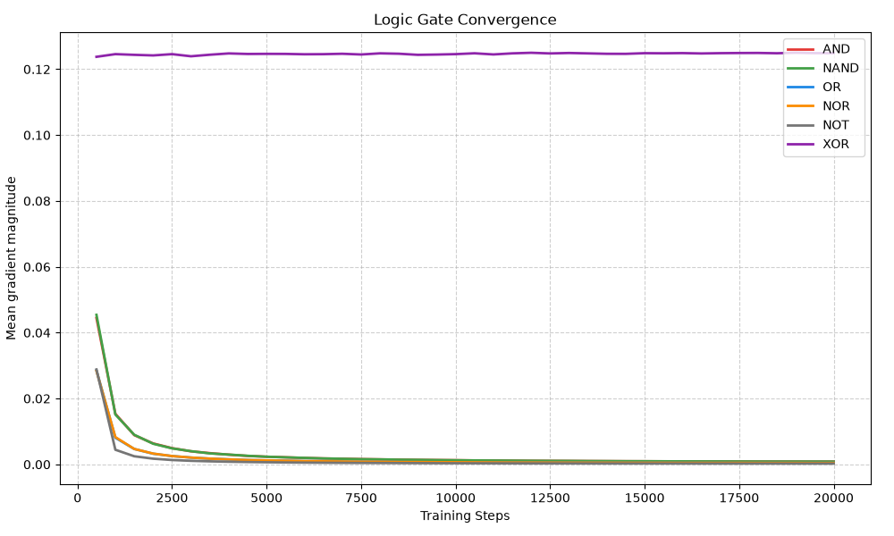
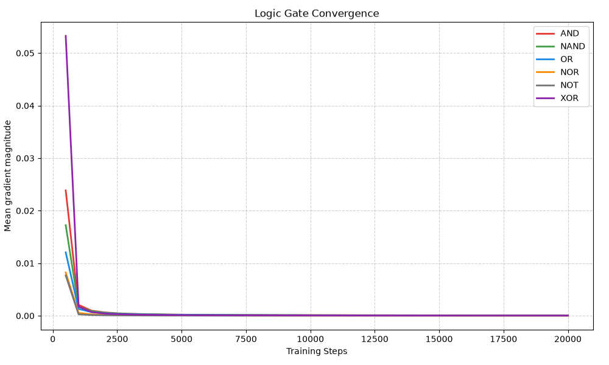

# Logic Gates with a Neural Network (NumPy, From Scratch)

A minimal experiment demonstrating why hidden layers exist. Uses a
from-scratch NumPy network with a supervised training path (sigmoid
output).

## The result

**Without a hidden layer**, AND, OR, NAND, NOR, and NOT all converge.
XOR does not — its gradient magnitude plateaus at ~0.12 and predictions
stay near 0.5.



**With one hidden layer of 4 neurons**, XOR converges too.



XOR is not linearly separable — no single-layer network can represent it.
This is the classic demonstration of why hidden layers are necessary.

## How it works

### Network (`network.py`)
- Fully connected feedforward network, built from scratch in NumPy.
- Leaky ReLU hidden activations, sigmoid output.
- Supervised training — the output-layer gradient corresponds to MSE loss, backpropagated through the hidden layers.
- Same architecture as my [tictactoe-numpy-nn](https://github.com/arman-hossain-sikder/tictactoe-numpy-nn) project, with a different output layer and training objective.

### Gates (`logic_gates.py`)
- Truth-table datasets generated programmatically for AND, OR, NAND, NOR, NOT, XOR.

### Training (`train.py`)
- 20,000 steps per gate, batch size 16.
- Learning rate decays linearly from 1.0 to 0.1.
- Each gate trains a fresh network (no weight sharing between gates).

## Setup

```bash
pip install numpy matplotlib
```

## Usage

```bash
python train.py
```

## Notes

- Y-axis is mean gradient magnitude at the output layer, not MSE loss.
  It converges to zero when the network is correct.
- The experiment is seeded (`np.random.seed(42)`) for reproducibility.

## Related

- [tictactoe-numpy-nn](https://github.com/arman-hossain-sikder/tictactoe-numpy-nn) — same architecture, applied to REINFORCE policy gradients
